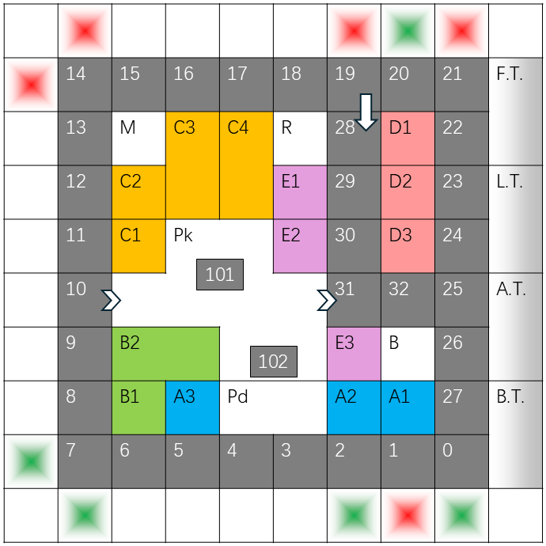

# Block No.7

A text-based board game written in Python, inspired by the classic Monopoly.
It simulates a realistic neighbourhood, featuring properties, jobs, parks, restaurants, markets, fishing, and more.
The project began as a Tkinter-based Monopoly clone and has since evolved into a more modular and extensible version.

---

## Board Layout



---

## Features
- **The Board**: Every item (e.g., a restaurant) is placed on a 10x10 grid. You can interact with items adjacent to your position, adding a spatial element to strategy.
- **Properties**: Purchase and upgrade properties. Collect rent when other players land on grids adjacent to your property.
- **Jobs**: Pay a small fee to apply for jobs, with acceptance based on probability. Earn salaries when you land on a grid next to your job’s tower. Influenced by *luck*.
- **Chests**: Randomized chests can provide rewards or penalties, classified into a 5-tier rarity system. Influenced by *luck*.
- **Fishing Pond**: Catch fish, crabs, or even sharks, and sell them at the market. Influenced by *luck*.
- **Park**: Can be purchased at a high price. Its rent starts at 0 but increases quickly. Owning the park also grants more access to the pond and provides a shortcut to avoid bad chests.
- **Market**: Buy fishing rods, glowing bait, controllable dice, and backpack upgrades.
- **Restaurant**: Eat food to increase your luck and improve your chances.
- **Bank**: Take loans with different repayment structures.
- **Luck System**: Affects chest outcomes, job applications, and fishing success.
- **Winning Condition**: The game ends when all but one player go bankrupt. The remaining player is declared the winner.

The game is currently **console-based** (CLI). Future work includes developing a web-based version with GUI.

---

## How to Run

- **Clone the repository**:
  ```
  git clone https://github.com/ctrl-shift-alt-tab-win/block-number-7.git
  cd block-number-7
  ```
- **Run the game**:
  ```
  python main.py
  ```
---

## Requirements

- Python 3.8+
- Standard library only (no external dependencies)

---

## Future Plans

- Build a web-based version using Flask for the backend and a JavaScript frontend for the GUI.
- Strengthen the spatial aspect of the game (e.g., buying a property increases nearby land prices).
- Add multiple board layouts, each with unique road and item placements, leading to distinct strategies.
